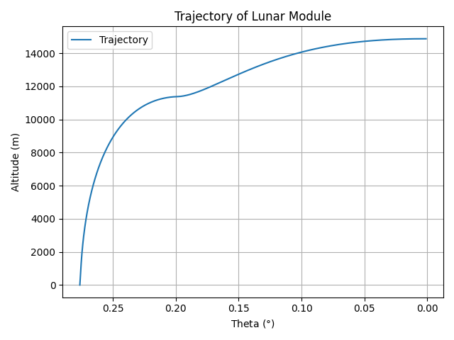

# Apollo Lunar Module Descent GNC Simulation


---

## 🚀 Project Overview

This project is a **closed-loop Guidance, Navigation, and Control (GNC) simulation of the Apollo Lunar Module (LM) powered descent**, developed to model **flight-software architecture, physical realism, and control-constrained behavior**, rather than purely optimal trajectories.

The simulation currently focuses on the **Braking Phase (Apollo P63)**, where the LM transitions from low lunar orbit into powered descent. The objective is not simply to achieve a soft landing, but to **replicate how real spacecraft flight software is structured, constrained, and validated**.

Key design principles:

- Explicit separation of **plant (truth model)**, **navigation**, **guidance**, **control**, and **actuation**
- Clear and consistent **state definitions and reference frames** (polar vs. LVLH)
- Incremental realism added through **hardware and actuator constraints**
- Control decisions based on **measured/filtered state**, not truth

---

## 🛠 Engineering & Technical Highlights

### 1. Dynamics & Physics Engine (Truth Model)

The translational dynamics are modeled in **polar coordinates** about the Moon:

- State vector:
[r, dr, θ, dθ, m]
- Central gravity:
$\[
\mu / r^2
\]$
- Full centrifugal and Coriolis coupling terms
- Continuous propellant mass depletion:
$\[
\dot{m} = -\frac{T}{I_{sp} g_0}
\]$

This layer represents the **physical truth model** and is intentionally more detailed than downstream guidance and control layers, mirroring real flight architectures.

---

### 2. Navigation (LVLH Frame)

The plant state is mapped into a **Local Vertical / Local Horizontal (LVLH)** frame used by guidance and control:

- LVLH state:
[z, dz, x, dx, m]

- `z = r − r_moon` → altitude above lunar surface (+up)
- `x = r · θ` → downrange distance (+forward)

Explicit sign conventions and frame definitions are enforced to avoid frame-mixing errors.  
This reflects real spacecraft navigation pipelines, where estimation and control do **not** operate directly in inertial coordinates.

---

### 3. Guidance

Guidance generates **commanded accelerations**, not actuator commands:

- Cubic polynomial, **receding-horizon guidance**
- Boundary-condition driven (position and velocity constraints)
- Outputs:
- `ddz_cmd` — vertical acceleration command
- `ddx_cmd` — horizontal acceleration command

Guidance is **hardware-agnostic**; feasibility is enforced downstream by control and actuator models.

---

### 4. Control (Acceleration → Thrust Allocation)

The control layer converts commanded accelerations into thrust magnitude and direction:

- Reconstructs local geometry (`r = r_moon + z`)
- Computes required radial and tangential thrust components
- Outputs:
- `T_cmd` — requested thrust magnitude
- `α_cmd` — commanded thrust pitch angle

This mirrors real flight software, where guidance specifies *what acceleration is desired*, and control determines *how actuators achieve it*.

---

### 5. Propulsion & Actuator Constraints

#### Descent Propulsion System (DPS) Throttle Logic

The LM Descent Propulsion System is modeled with **Apollo-inspired throttle behavior**:

- **100% thrust** when demand ≥ 65%
- **Continuously throttleable** between 10–65%
- **Minimum throttle floor** at 10% while the engine is active
- Automatic cutoff at dry mass

This produces realistic “ride-the-stop” behavior during aggressive braking phases.

#### Mass Depletion

- Propellant mass decreases continuously with thrust
- Engine shuts down at dry mass
- Prevents nonphysical $\( T/m \rightarrow \infty \)$ behavior

---

### 6. Attitude / Gimbal Dynamics

Rather than assuming instantaneous thrust vectoring, the simulation includes a **rate-limited actuator model**:

- Separate actuator state: `α_actual`
- Slew-rate limiting:
$\[
|\dot{\alpha}| \le \dot{\alpha}_{max}
\]$
- The plant receives the **rate-limited** thrust direction

This captures actuator realism without unnecessarily coupling rotational dynamics into the translational state.

---

## 📊 Telemetry, Visualization & Verification

### Trajectory Visualization


Tracks altitude versus downrange distance relative to the landing site.

### Telemetry Outputs


Logged throughout descent:
- Vertical and horizontal velocity
- Commanded vs. actual pitch angle
- Commanded vs. actual thrust
- Propellant mass remaining

### Mission End-State Metrics

Each run produces an automated mission log including:
- Time of flight
- Impact velocity
- ΔV expended
- Remaining propellant

See the latest results in the [Mission Log](./data/MISSION_LOG.md).

---

## 📂 Project Structure

```bash
├── main.py             # Simulation loop and system integration
├── simulation.py       # Plant dynamics and numerical integration
├── navigation.py       # Polar → LVLH frame conversion
├── guidance.py         # Polynomial guidance laws
├── controller.py       # Thrust and pitch allocation
├── sensor.py           # Radar altimeter noise and bias model
├── visualization.py    # Telemetry and plotting utilities
├── environment.py      # Physical constants and vehicle parameters
├── test.py             # Standalone tests and trajectory checks
├── README.md           # Project documentation
└── LICENSE
```
The codebase is intentionally modular to support incremental upgrades to estimation, guidance logic, and robustness testing.

---

## 🔧 Current Limitations

- Braking phase (P63) only  
- Fixed time-to-go (not yet state-scheduled)  
- Single-axis attitude model (pitch only)  
- No terrain or landing-leg interaction  

---

## 🔜 Planned Extensions

- High Gate / Low Gate phase transitions (P64-style)  
- State-dependent time-to-go scheduling  
- Fuel-optimal guidance laws  
- Higher-order numerical integrators (RK4)  
- Monte Carlo dispersions  
- Explicit rotational dynamics  
- Validation against published Apollo descent telemetry  

---

## 📚 References & Data Sources

1. **NASA Manned Spacecraft Center**, *Apollo Lunar Descent and Ascent Trajectories*, Nov 1970
   [https://ntrs.nasa.gov/api/citations/19700024568/downloads/19700024568.pdf](https://ntrs.nasa.gov/api/citations/19700024568/downloads/19700024568.pdf)
2. **NASA Manned Spacecraft Center**, *Mission Planning for Lunar Module Descent and Ascent*, Jun 1972 [https://ntrs.nasa.gov/api/citations/19720018205/downloads/19720018205.pdf](https://ntrs.nasa.gov/api/citations/19720018205/downloads/19720018205.pdf)
2. **NASA Safety & Mission Assurance**, *Apollo 11 Mission Report (Significant Incidents)*
   [https://sma.nasa.gov/SignificantIncidents/assets/a11_missionreport.pdf](https://sma.nasa.gov/SignificantIncidents/assets/a11_missionreport.pdf)
3. **Aircraft Engine Historical Society**, *The Lunar Module Descent Engine (LMDE)*
   [https://www.enginehistory.org/Rockets/RPE09.46/RPE09.46.shtml](https://www.enginehistory.org/Rockets/RPE09.46/RPE09.46.shtml)
4. **Wikipedia Contributors**, *Apollo Lunar Module* / *Descent Propulsion System*  
   [https://en.wikipedia.org/wiki/Apollo_Lunar_Module](https://en.wikipedia.org/wiki/Apollo_Lunar_Module)

---

## 👤 Author

**Eliott Hendryx-Parker**  
Aerospace Engineering Student | Guidance, Navigation & Control | Flight Dynamics  

---

## ⚠️ Disclaimer

This project is **educational** and not flight-certified. Numerical values are representative and intended for learning and demonstration purposes only.

