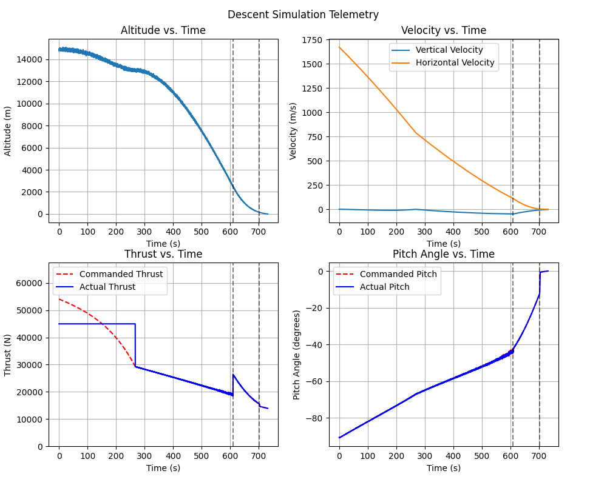

# Apollo Lunar Module Powered Descent GNC Simulation


---

## Overview

This project is a closed-loop Guidance, Navigation, and Control (GNC) simulation of Apollo-style lunar powered descent.

The simulation models:

- Polar-coordinate translational dynamics about the Moon
- Navigation frame transformation to LVLH
- Polynomial, boundary-condition-driven guidance
- Thrust magnitude and attitude allocation with actuator constraints
- Multi-rate execution (10 Hz GNC / 100 Hz plant integration)

The goal is to reflect realistic flight software structure rather than compute an idealized trajectory.

---

## System Architecture

The simulation separates major flight software functions:

- **Plant (Truth Model)** — Lunar translational dynamics in polar coordinates  
- **Navigation** — Converts polar state to LVLH frame  
- **Guidance** — Generates commanded accelerations using cubic boundary-value polynomials  
- **Control** — Converts commanded accelerations to thrust magnitude and pitch angle  
- **Actuator Model** — Applies throttle limits and gimbal slew-rate constraints  

This modular structure mirrors aerospace flight software partitioning.

---

## Dynamics Model

State vector:

$$\begin{align}
   \mathbf{x} = \begin{bmatrix}
      r & \dot{r} & \theta & \dot{\theta} & m
   \end{bmatrix}
\end{align}$$


Equations include:

- Central gravity:
  
  \[
     $\frac{\mu}{r^2}$
  ]

- Centrifugal and Coriolis coupling terms
- Continuous mass depletion:

  \[
      $\dot{m} = -\frac{T}{I_{sp} g_0}$
  \]

The plant is integrated at 100 Hz using fixed-step integration.

---

## Navigation (LVLH Frame)

The plant state is mapped to a Local Vertical / Local Horizontal frame:

$$\begin{align}
   \mathbf{x} = \begin{bmatrix}
      z & \dot{z} & x & \dot{x} & m
   \end{bmatrix}
\end{align}$$

- \[
      $z = r - r_{moon}$
  \]
- \[
      $x = r \cdot \theta$
  \]

Guidance and control operate exclusively in LVLH coordinates.

---

## Guidance

Guidance computes commanded accelerations:

- \($\ddot{z}_{cmd}$\)
- \($\ddot{x}_{cmd}$\)

A cubic polynomial is solved each cycle using boundary conditions on position and velocity. Time-to-go is stage-dependent.

Guidance runs at 10 Hz.

---

## Control

Control converts commanded accelerations into:

- Thrust magnitude
- Pitch angle

Constraints modeled:

- Throttle floor (10%)
- Throttle ceiling (100%)
- Gimbal slew-rate limit
- Automatic thrust cutoff at dry mass

Commands are held constant between control updates.

---

## Telemetry

### Descent Telemetry



Telemetry includes:

- Altitude vs time
- Vertical and horizontal velocity
- Commanded vs actual thrust
- Commanded vs actual pitch angle

---

## Mission Output

At termination, the simulation reports:

- Time of flight
- Impact velocity
- Delta-V expended
- Remaining propellant mass

---

## Project Structure
```bash
data/
figs/
gnc/
sim/
viz/
states.py
config.py
main.py
telemetry.py
```
Modules are intentionally separated to support incremental upgrades (estimation, higher-order integration, Monte Carlo analysis).

---

## Current Scope

- Powered descent only  
- Stage-based guidance timing  
- Translational dynamics only  
- No terrain or landing-leg interaction  

---

## References

1. NASA Manned Spacecraft Center, *Apollo Lunar Descent and Ascent Trajectories*, Nov 1970  
   https://ntrs.nasa.gov/api/citations/19700024568/downloads/19700024568.pdf  

2. NASA Manned Spacecraft Center, *Mission Planning for Lunar Module Descent and Ascent*, Jun 1972  
   https://ntrs.nasa.gov/api/citations/19720018205/downloads/19720018205.pdf  

3. NASA Safety & Mission Assurance, *Apollo 11 Mission Report*  
   https://sma.nasa.gov/SignificantIncidents/assets/a11_missionreport.pdf  

4. Aircraft Engine Historical Society, *Lunar Module Descent Engine*  
   https://www.enginehistory.org/Rockets/RPE09.46/RPE09.46.shtml  

5. Wikipedia Contributors, *Apollo Lunar Module / Descent Propulsion System*  
   https://en.wikipedia.org/wiki/Apollo_Lunar_Module  

---

## Author

Eliott Hendryx-Parker  
Aerospace Engineering | Guidance, Navigation & Control  

---

## Disclaimer

This project is educational and not flight-certified. Numerical values are representative.
